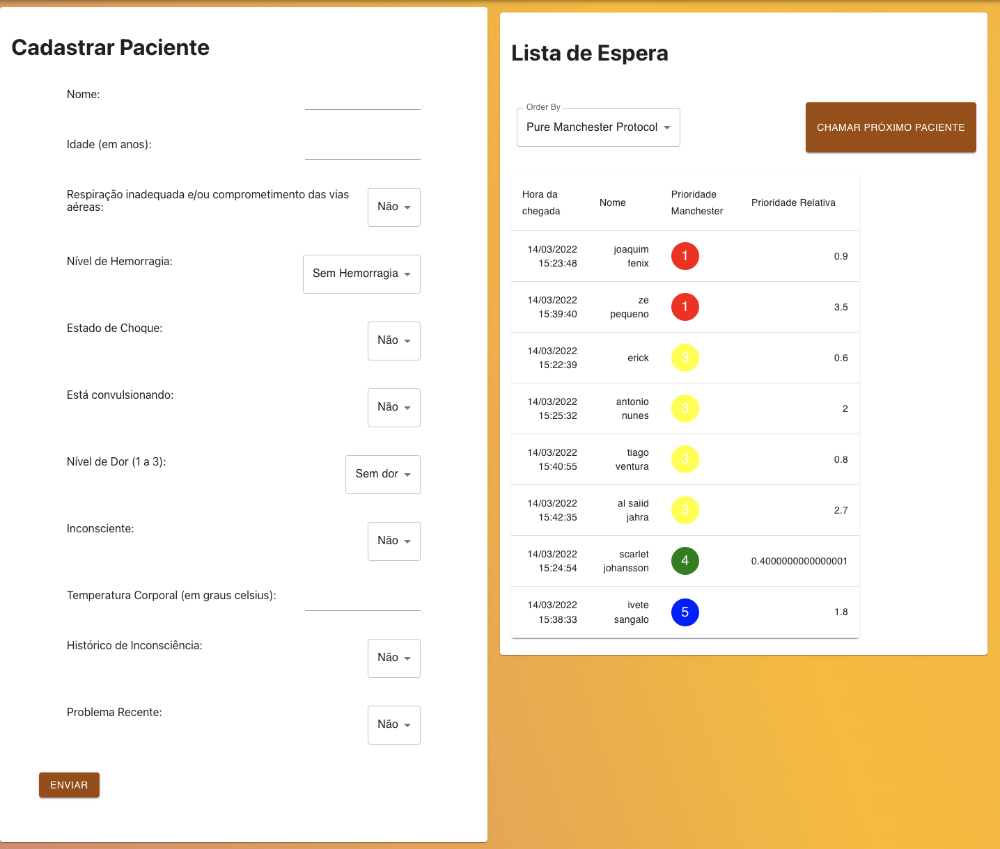
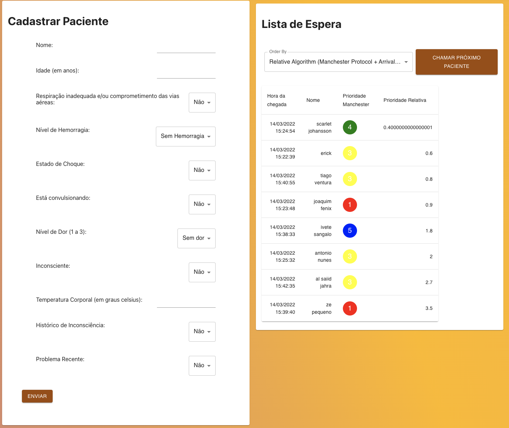

# Hospital Triage

**Disciplina**: FGA0210 - PARADIGMAS DE PROGRAMAÇÃO - T01 <br>
**Nro do Grupo**: 02<br>
**Paradigma**: Lógico<br>

## Alunos
|Matrícula | Aluno |
| -- | -- |
| 18/0014412 |  Cainã Freitas |
| 17/0141161 |  Erick Giffoni |
| 18/0016563 |  Filipe Machado |
| 18/0105345 |  Lucas Ferraz |
| 16/0015006 |  Matheus O. Patrício |
| 17/0122468 |  Nilvan Peres |
| 18/0011308 |  Peniel Etèmana |
| 18/0078640 |  Yuri Alves |

## Sobre 
O projeto contempla a implementação de um sistema de triagem de pacientes considerando um contexto hospitalar.
O projeto se divide em duas partes, uma delas sendo o servidor HTTP feito utilizando a linguagem de programação PROLOG, e a parte do front-end produzida utilizando Javascript, HTML e CSS, junto ao framework ReactJS.

A motivação para esse projeto surgiu pois um dos membros do grupo ficou bastante doente e teve que passar a frequentar o hospital. Em uma dessas visitas, notou a existência de um processo de triagem de pacientes seguido da adição deles a uma fila de prioridades de atendimento; Imediatamente observou-se que isso poderia ser implementado seguindo o paradigma lógico.

O projeto contempla desde a triagem do paciente até a adição dele na fila de prioridades e a chamada do mesmo. A triagem é feita ao preencher um formulário de anamnese na página inicial com informações sobre o estado de saúde do paciente. Em seguida, nossos algoritmos são capazes de identificar qual a classificação daquele paciente segundo o [Protocolo de Manchester](https://passevip.com.br/pulseiras-protocolo-de-manchester/) e, então, adicioná-lo na fila.

A fila de prioridade de atendimento também é mostrada na página inicial. Foram implementadas 3 estratégias de prioridade para a fila: por ordem de chegada; por protocolo manchester; e por prioridade relativa (leva em conta a ordem de chegada e a classificação segundo o protocolo Manchester).

Para cada novo paciente inserido na fila, esta é reorganizada para que os atendimentos aconteçam segundo a lógica especificada (ordem de chegada, ou protocolo Manchester ou prioridade relativa).

## Screenshots

Página inicial:


Após adicionados alguns pacientes...

Fila segundo a ordem de chegada:


Fila segundo o Protocolo Manchester:



Fila segundo a prioridade relativa:



# Instalação 
**Linguagens**: Prolog, Javascript, HTML, CSS<br>
**Tecnologias**: [ReactJS](https://pt-br.reactjs.org/), [Material Ui](https://mui.com/pt/), Yarn, Docker, Docker-compose, Make<br>

É necessário instalar o SWI-Prolog para a execução correta.
Recomenda-se baixar de [SWI-Prolog](https://www.swi-prolog.org/download/stable).

## Instalação Linux: 

Garantir que as dependências estejam instaladas e atualizadas:
```
% sudo apt-get install software-properties-common
% sudo apt-add-repository ppa:swi-prolog/stable
% sudo apt-get update
```
Comando de instalação do prolog:
```
% sudo apt-get install swi-prolog
```

#### Front-End

A instalação das dependências do front-end ocorrem dentro de um container docker gerenciado por um arquivo `Makefile`.
Executando o comando `make run` na pasta raíz do projeto já faz com que o front-end seja instalado e executado em sistemas operacionais Linux.

# Uso 

O programa é compostos de duas partes:
  - Servidor HTTP -> Prolog
  - Front End -> ReactJS


## 1. Para iniciar o servidor HTTP:

```
$ prolog -f main.pl
```

OBS: O Servidor HTTP Utiliza a porta `8000/tcp`.

> No MacOS:

```
$ swipl -f main.pl
```

## 2. Para iniciar o Front-End:

```
$ make run
```
  Obs: Para parar a execução do front-end completamente, usa se o comando `$ make stop`


3. Atenção: O servidor executado pelo PROLOG está com problema de CORS devido à práticas de desenvolvimento web que não são mais utilizadas. Para ignorar isso, é necessário que [o seu navegador seja inicializado com opções de segurança desativadas](https://alfilatov.com/posts/run-chrome-without-cors/). Exemplo:

#### Linux:

Utilizando Google Chrome:
```
$ google-chrome --disable-web-security --user-data-dir=~/chromeTemp
```

#### Windows10:

```
"C:\Program Files (x86)\Google\Chrome\Application\chrome.exe" --disable-web-security --disable-gpu --user-data-dir=~/chromeTemp
```

#### MacOS:

```
open -n -a /Applications/Google\ Chrome.app/Contents/MacOS/Google\ Chrome --args --user-data-dir="/tmp/chrome_dev_test" --disable-web-security
```

### 4. Acesse o navegador web de sua preferência no endereço `127.0.0.1:3000` ou `localhost:3000`.

## 5 Utilização do sistema:

Após o sistema ter sido inicializado corretamente, é necessário adicionar pacientes na fila de espera do hospital.
Para isto, basta preencher corretamente o formulário com os dados do paciente e clicar no botão de adicionar na lista de espera.

Após você adicionar pessoas na lista de espera, nota-se a lista ao lado do formulário, composta dos dados preenchidos junto à dados de decisão de prioridade.

Desses dados vale a pena a explicação de dois dados que não são tão intuitivos, são estes: `Manchester Priority` e `Relative Priority`

#### Manchester Priority

Refere-se ao [Prtocolo de Manchester](http://redec.com.br/blog/classif_risco/importancia-do-protocolo-de-manchester/), que é um método de triagem utilizado em hospitais do qual a prioridade inicial da triagem do paciente é definida por características básicas de fácil aferição, que após avaliadas, dão uma pulseira pro paciente com uma cor correspondente à sua prioridade.

> 

> Imagem retirada do site `http://redec.com.br/blog/classif_risco/importancia-do-protocolo-de-manchester/`.

#### Relative Priority

Esse algoritmo de ordenação leva em conta uma prioridade relativa da qual considera-se inicialmente a prioridade dada pelo Protocolo de Manchester e essa prioridade é modificada a cada pessoa nova que entra na lista de espera, de forma que a ordem de chegada seja levada em consideração e a prioridade do paciente que está esperando há muito tempo seja alterada de forma que esse paciente não fique esperando sua vez eternamente caso sempre seja chamado alguém com a prioridade maior que a sua.

Quanto menor o número, maior sua prioridade.

## Vídeo
Adicione 1 ou mais vídeos com a execução do projeto.

## Outros 
#### Problemas Técnicos:

##### CORS

O grupo não encontrou problemas na implementação básica de um servidor HTTP utilizando PROLOG. O problema ocorre quando os navegadores modernos têm implementados nativamente um protocolo CORS, que é referente a web-segurança, que impõe restrições quanto a requisições web que partem da mesma origem, e para passar por tais restrições é necessário que as requisições contenham os dados requisitados pelo protocolo CORS em seus headers. O problema é que as bibliotecas nativas do SWI-Prolog não conseguem formatar os headers de forma que os navegadores modernos interpretam; O prolog utiliza de uma técnica obsoleta que parte de escrever os headers no corpo da mensagem retornada pelo servidor, e isso não é recomendado e nem aceito atualmente pelos navegadores web. Para burlar esse protocolo, o grupo decidiu iniciar o navegador web desativando os procedimentos de segurança, fazendo assim que o protocolo CORS não seja checado.

##### PROLOG com JSON

Inicialmente o grupo decidiu dividir o projeto em pequenas tarefas para que depois haja a integração de tudo. Porém um dos grupos separados tiveram muita dificuldade com a implementação de soluções que realizam a leitura de arquivo `.json` e isso fez com que o projeto ficasse atrasado; O grupo conseguiu contornar essa situação fazendo pair programming com todos os integrantes do grupo para esclarecer e ajudar com conceitos de prolog.

#### Implementações Futuras:

O grupo pensando em implementações futuras, decidiu que seria interessante implementar a triagem considerando pessoas que devem ter uma atenção em questão de espera, sendo estes: Idosos, diabéticos, grávidas, pessoas que chegam de ambulância e entre outros.

Outra implementação interessante seria de considerar consultórios com médicos, de forma que a chamada de pacientes indique o consultório que o paciente deverá seguir.

## Fontes

Estudo sobre protocolo de manchester:
[EscolaDeSaudePublica](https://github.com/EscolaDeSaudePublica/devLab/issues/7)
[RedeC](http://redec.com.br/blog/classif_risco/importancia-do-protocolo-de-manchester/)

Estudo sobre servidor HTTP em Prolog:
[Anniepoo:swiplwebtut](https://github.com/Anniepoo/swiplwebtut/blob/master/web.adoc)

Solução temporária de problema com CORS:
[alfilatov](https://alfilatov.com/posts/run-chrome-without-cors/)
